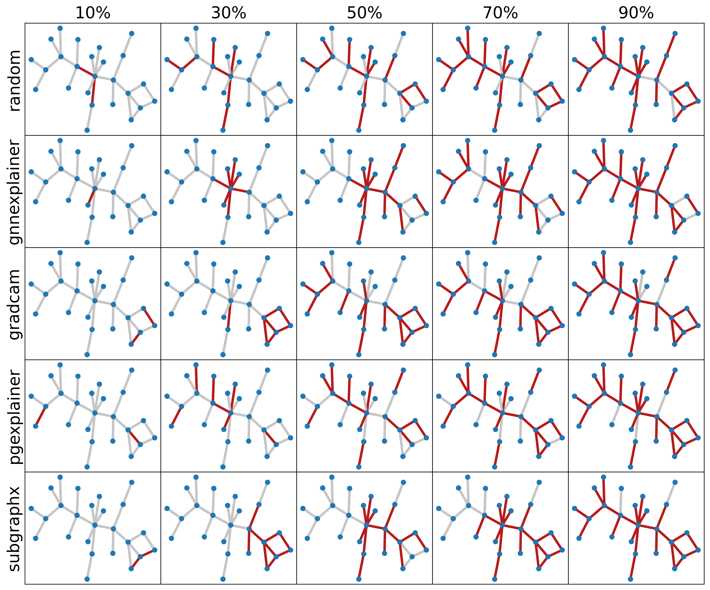

# GraphROAR
<p align="center">
    
  <br/>
</p>
At the moment, several evaluation metrics have been proposed to assess the faithfulness of state-of-the-art explanation methods for graph neural networks. During this project, we challenged these metrics and instead propose a novel benchmark to fairly compare the faithfulness of these explainers by executing lots of experiments on different datasets and in different settings on our method. More precisely, we formulated the retraining by either keeping (GraphKAR) or removing (GraphROAR) the most informative edges provided by each explainer and thereafter checking their impact using retraining steps.

## Contents:
  - [Overview](#overview)
    - [Baseline](#baseline)
    - [Explanation](#explanation)
    - [Retraining](#retraining)
  - [Data](#data)
  - [Configuration](#configuration)
  - [Run](#run)

## Overview
All running entry points are located at `src/GNN_Explainability/entrypoints/` and In general, there are three groups of running:
### Baseline
This includes training graph neural networks, basically graph convolutions, to be later perceived by explainers. Their relative addresses follow this pattern `train_gcn.[dataset].base.[gcn3l or gin3l]`.
### Explanation
The explainers will provide edge weightings per instance for retraining experiments. Despite others, SubgraphX does not provide probability edge weightings. Instead, we introduced a trick in which for each of the five percentages proposed in the retraining stage (10, 30, 50, 70, and 90), a separate set of binary edge masks is stored. their relative addresses follow this pattern: `explain_gcn.[dataset].[gcn3l or gin3l].[explainer]`.
### Retraining
Now to measure and compare explainer methods, probability edge weightings provided by these explainers are used to either keep (GraphKAR) or remove (GraphROAR) most informative edges and thereafter check their impact using the retraining step. Their relative addresses follow this pattern `train_gcn.[dataset].[kar or roar].[gcn3l or gin3l].[explainer]`.

## Data
At first, within the root directory of this repo, create a `data` folder. then download BA-2Motifs from [here](https://drive.google.com/file/d/134We2cb2PjoY1b6-k8KLmfviM0M4CEkT/view?usp=sharing), BA-3Motifs, a new multi-class benchmark dataset proposed in our paper, from [here](https://drive.google.com/drive/folders/1ZGrosPKm85phN54tSGl7-lmQFx-w4NTd?usp=sharing), and the rest from [TUDataset](https://chrsmrrs.github.io/datasets/). Except for BA-2Motifs, the folder hierarchy of the rest is identical; which should be the same with the following:
```
data/
    ba_2motifs/
        processed/
           data.pt
    BA3Motifs/
        raw/ 
            BA3Motifs_A.txt
            BA3Motifs_graph_indicator.txt
            BA3motifs_graph_labels.txt
    ENZYMES/
        raw/
            ...
    IMDB-BINARY/
        raw/
            ...
    REDDIT-BINARY/
        raw/
            ... 
    MUTAG/
        raw/
            ...
```
For each dataset, the probability edge weights provided by each explainer during the second stage will be saved in the `data/[dataset]/explanation` folder.

## Configuration
Running configurations are located in `src/GNN_Explainability/config/`. The general configuration, including [baseline](#baseline) stage, is located at `base_config.py`, [explanation](#explanation) at `explanation/` and [retraining](#retraining) at `roar_config.py`; To know in detail about the attributes within each one, check out the documentation provided below of each attribute. 

## Run
To run each of the three groups mentioned in [overview](#overview), first change your directory to `src/`, then enter this command: `python main.py [seed number] [pattern of one of these three groups]`. For instance, to run GraphKAR on GradCAM explanation using GCN3l network and BA-2Motifs dataset, this command is required: `python main.py 12345 train_gcn.ba2motifs.kar.gcn3l.gradcam`. All seed numbers we used are listed in `src/main.py`.  
